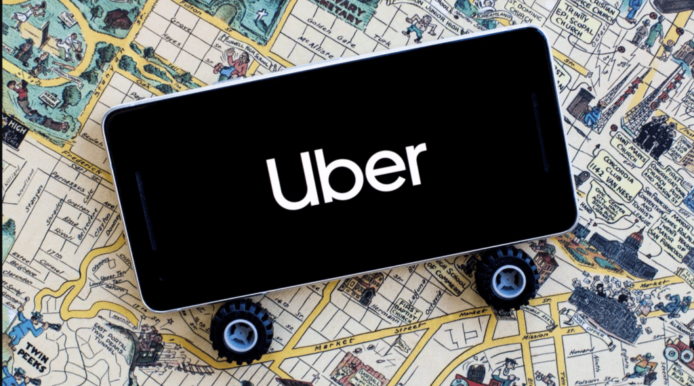

# Economía digital

## ¿Por qué?

Inteligencia artificial|Análisis de datos|Internet de las cosas (IoT)|CLoud|Tecnologías móviles
-|-|-|-|-|

    El mundo digital está sobre nosotros:

    - Cada presupuesto, es un presupuesto de tecnologías
    - Cada empresa es una empresa de tecnologías
    - Cada líder empresarial se está convirtiendo en un líder digital
    - Cada persona se está convirtiendo en una empresa de tecnología

[Gartner Symposium/ITxpo Analyst Opening Keynote](https://www.youtube.com/watch?v=J3JX84qEj-Q)

A medida que las tecnologías digitales se volvieron más accesibles y ampliamente adoptadas, su impacto en los procesos de negocio y en la economía en general aumentó de un modo significativo.

### Ej.: Taxis, Uber & Lyft

- Antes de la llegada de Uber y Lyft, la forma tradicional de obtener un taxi era llamando a una compañía de taxis o parándolo en la calle.
- Los pasajeros solían tener que esperar largos períodos de tiempo para conseguir un taxi y, en algunos lugares, podían ser víctimas de precios excesivos o incluso fraudes.
- Con la llegada de Uber y Lyft, los pasajeros pueden solicitar un viaje desde su teléfono móvil y recibir una respuesta en minutos.
- La tecnología de geolocalización permite que el conductor se dirija directamente al lugar donde se encuentra el pasajero, lo que ahorra tiempo y reduce el riesgo de confusiones.
- La tecnología también permite que los pasajeros paguen por sus viajes a través de la aplicación móvil, lo que es más rápido y conveniente que el pago en efectivo.
- Las empresas de transporte de pasajeros pueden utilizar tecnologías de análisis de datos para comprender mejor a sus clientes y mejorar sus procesos de negocio.
- Las mejoras en la experiencia del cliente pueden cambiar la forma en que las empresas operan y compiten.

> #notaMental: mencionar el Manifiesto Cluetrain y la bidireccionalidad del efecto Empresa - Tecnología - Cliente

### Ej.: Hoteles y AirBnB

- Antes de la llegada de Airbnb, los turistas reservaban alojamiento en hoteles, moteles y otras empresas de alojamiento.
- Airbnb permite a cualquier persona ofrecer habitaciones o viviendas para alquilar a través de la plataforma.
- Los precios de Airbnb son flexibles y pueden variar según la oferta y la demanda.
- Airbnb ofrece a los huéspedes una experiencia de alojamiento más personalizada y auténtica al alojarse en viviendas privadas y tener contacto directo con los anfitriones.
- Airbnb utiliza tecnologías digitales como el análisis de datos para comprender mejor las preferencias de los huéspedes y mejorar la experiencia de usuario.

## ¿Qué?

La propia naturaleza de evolutiva del ecosistema empresarial, la tecnología y su mutua influencia hacen que este **término** esté en constante cambio

|Fecha/Evento|Cómo se entendía el término, de qué se hablaba, qué se analizaba|
-|-
Mediados de los 90s|[Don Tapscott](https://dontapscott.com/) acuña el término en su libro "La economía digital"
A finales de los 90s|Adopción de internet y su impacto en la economía *(Brynjolfsson y Kahin, 2002; Tapscott, 1996)*
Mediados de la primera década del 2000|Aparición y crecimiento de la economía del internet
*Time passes* 2012, 2014...|Análisis de políticas y tecnologías digitales, empresas TIC como actores principales
2016, 2017...|Mejora de internet en paises en desarrollo, ampliación de empresas, productos y servicios digitales, 
2019 *et al*|Foco en la *digitalización* (transición que llevan a cabo las empresas por medio del uso de las tecnologías)
---

### [Artículo de economía digital@Banco Santander](https://www.santander.com/es/stories/economia-digital)

|||
|-|-|
La economía digital se refiere al uso de las tecnologías de la información en los procesos de producción de bienes y servicios, así como en su comercialización y consumo.  Este término pone de manifiesto cómo la industria crea productos y servicios nuevos o transforma los existentes, aprovechando la tecnología.|Thomas Mesenbourg explicó en un trabajo publicado en 2001 que existen tres componentes que definen a la economía digital y la diferencian de la tradicional:  **Infraestructura** Son los recursos tecnológicos con los que cuenta el negocio. Incluye tanto a los programas informáticos (software), los equipos (hardware) y el talento humano especializado.  **Negocio electrónico** Se refiere a los procesos que se desarrollan valiéndose de aplicaciones informáticas, herramientas en línea o plataformas digitales. **Comercio electrónico** Es el concepto más familiar, pues se trata de la compra y venta de productos y servicios a través de Internet.

### Algunos ejemplos:

- La banca digital
- El comercio electrónico
- La educación virtual
- Las aplicaciones móviles
- Las plataformas colaborativas

## ¿Para qué?
En el contexto de la dirección de sistemas de información, la economía digital se refiere específicamente al papel de las tecnologías de la información y la comunicación (TIC) en la creación de valor empresarial y en la mejora de los procesos de negocio.

||Estrategia|Planificación
|-|-|-
**Empresa**|Diseña su estrategia identificando oportunidades para mejorar los procesos de negocio y en la búsqueda de ofrecer nuevos productos y servicios que aprovechen las tecnologías digitales.   La estrategia empresarial debe ser flexible y adaptable para permitir cambios en respuesta a los cambios en el mercado y en la tecnología.|La planificación debe involucrar a todas las áreas de la empresa, incluyendo la dirección de sistemas de información, la dirección de operaciones y la dirección de marketing.  Enfocada en cómo la tecnología puede:  - Mejorar los procesos de negocio - Reducir costos - Aumentar la eficiencia - Mejorar la experiencia del cliente.

### ¿Y la innovación?

 La innovación debe estar integrada en la estrategia empresarial, la planificación y la gestión de la empresa, para permitir el desarrollo de nuevas tecnologías y soluciones que puedan mejorar los procesos de negocio, ofrecer nuevos productos y servicios y mejorar la experiencia del cliente.

Es posible|Se pueden ofrecer nuevas formas de|Manteniendo la atención en conceptos como
-|-|-
Recopilación Procesamiento Análisis de datos|Gestionar los procesos de negocio  Abordar la interacción    - Con los clientes   - Con los proveedores|Ciberseguridad Gestión de datos Integración & detección de tecnologías emergentes

## ¿Cómo?

Para ver cómo podemos transformar los negocios tenemos que **poder entender como funciona cada uno** y cuales pueden ser las palancas digitales con las que podemos transformar el negocio o darle una importante ventaja competitiva.