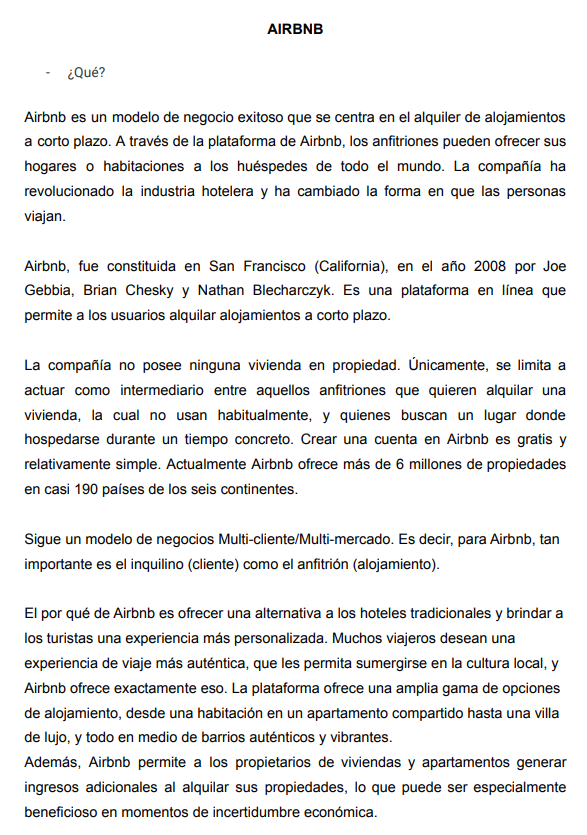
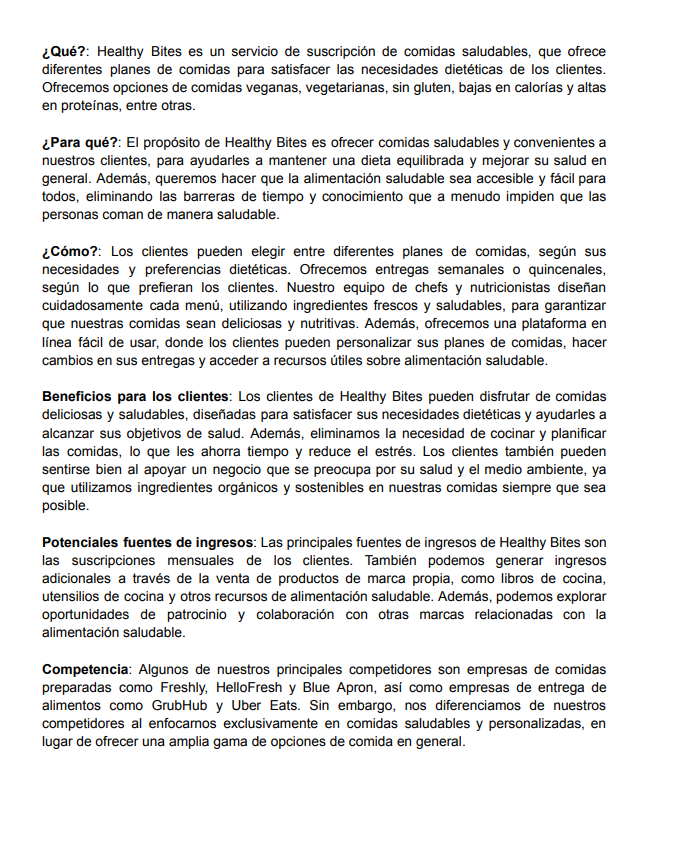
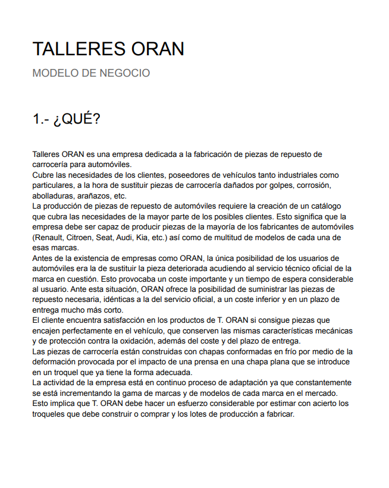
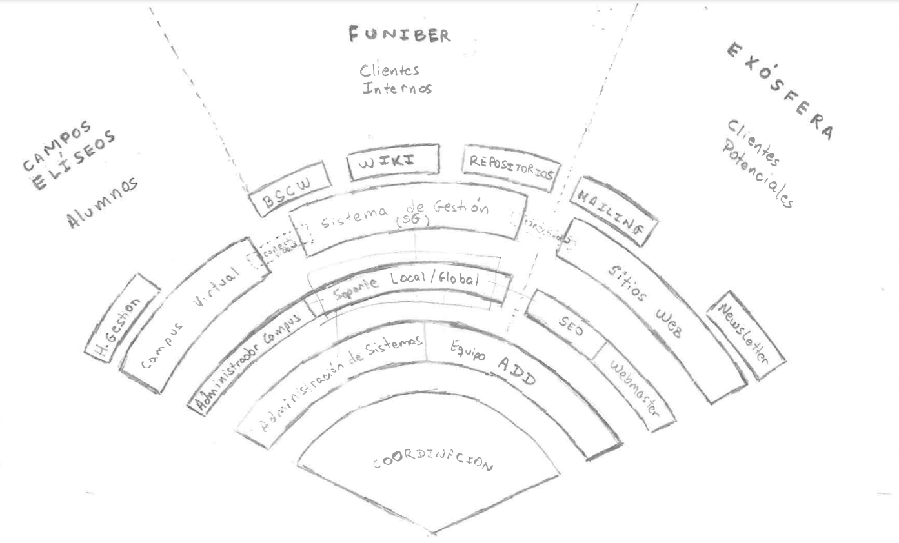

# Herramientas y Marcos de trabajo

## ¿Por qué?

Modelo 1|Modelo 2|Modelo 3|Modelo 4|
-|-|-|-
|||

### Evitar ambigüedades en la comunicación

|||
|-|-|
|La misma persona interpreta lo mismo del mismo diagrama pasado el tiempo, una servilleta con un garabato sin estandarizar, …​|distintas personas interpretan lo mismo del mismo diagrama, transparencias / diapositivas / …​ muy bonitas sin estandarizar, …​|

## ¿Qué?

## ¿Para qué?

- Para desarrollar y visualizar su modelo de negocio. 
- Ayuda a entender las partes clave de un modelo de negocio y cómo se relacionan entre sí.

## ¿Cómo?
