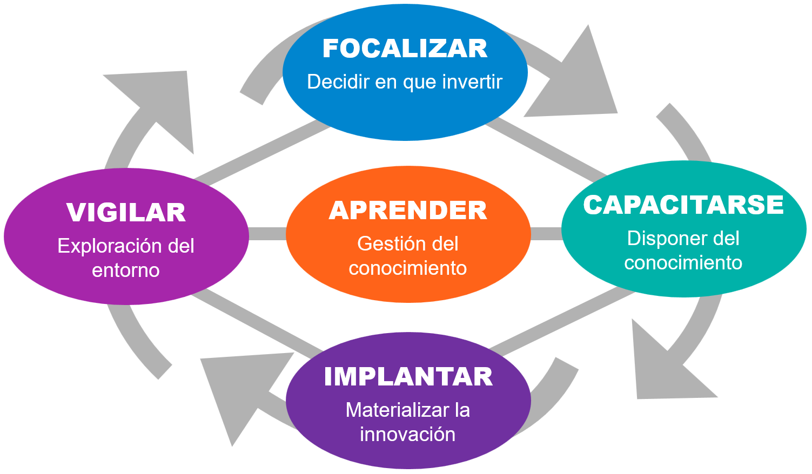

# El modelo de innovación como proceso

<table>
  <tr>
    <td>
        <ul>
        <li><a href="t01-03-02-s00-aprender.md"><b>Aprender</b></a></li>
        <li><a href="t01-03-02-s01-vigilanciaTecnologica.md"><b>Vigilar</b></a></li>
        <li><a href="t01-03-02-s02-focalizar.md"><b>Focalizar</b></a></li>
        <li><a href="t01-03-02-s03-capacitarse.md"><b>Capacitarse</b></a></li>
        <li><a href="t01-03-02-s04-implantar.md"><b>Implantar</b></a></li>  
        </ul>
    </td>
    <td>
    
    </td>
  </tr>
</table>
