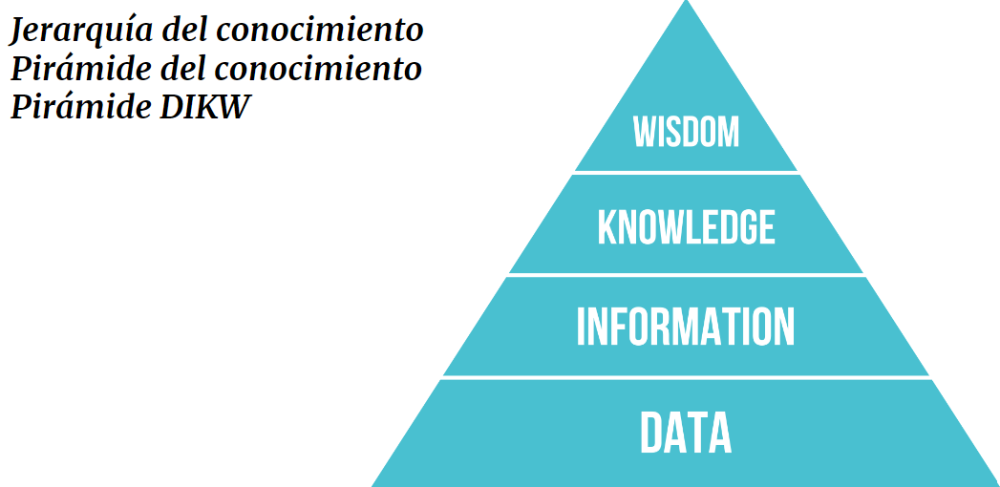

# Definición de Sistemas de Información

## ¿Por qué?

- Las organizaciones requieren tomar decisiones informadas y a mejorar la eficiencia operativa.
- Las organizaciones necesitan recopilar, procesar y almacenar información de manera eficiente y efectiva.
- Las organizaciones tienen diversos componentes que interactuan entre sí de modo organizado para cumplir con estos dos puntos previos.

A medida que la sociedad en general y las organizaciones en particular se volvieron más complejas y dependientes de la información, se hizo evidente que hacían falta soluciones estructuradas y sistemáticas para enfrentar estos desafíos.

## ¿Qué?

### Sistema

> Un Sistema es un conjunto de componentes interactuando o interdependientes formando un todo integrado. Cada sistema está delimitado por sus límites espacio/temporales e influenciado por su entorno, descrito por su estructura y propósito y expresado en su funcionamiento.

|Sistema|Sistema respiratorio|Película de amor|Numeros Romanos|Semaforo
|-|:-:|:-:|:-:|:-:
**conjunto de componentes interactuando o interdependientes formando un todo integrado.**|nariz, laringe, faringe, traquea, pulmones, alveolos, …​|personajes|I, V, X, L, C, D y M|Rojo, verde y amarillo
**Cada sistema está delimitado por sus límites espacio/temporales**|fechas y lugares de la vida del ser vivo que contiene el sistema respiratorio|fechas y lugares de los personajes|fechas y lugar donde estén escritos|fechas y lugar de la instalación del semáforo
**e influenciado por su entorno,**|lo que respira: aire limpio vs contaminado, …​|la sociedad, las familias, una ex-pareja, …​|en desuso en favor de sistemas de numeración poscionales (indo-arábigo, maya, chino, …​) mucho más efectivos|fuente de energía, climatología, vándalos, artistas, …​
**descrito por su estructura**|la nariz se conecta con la laringe, la laringe con la traquea, …​|argumento que relaciona los personajes de la historia|grupos de máximo 3 elementos consecutivos, grupo con elemento y opcionalmente un elemento inferiro prefijo o sufijo, …​|de rojo a verde, de verda a amarillo y de amarillo a verdo y/o rojo, …​
**y propósito**|inyectar oxigeno al sistema circulatorio extrayendo monóxido de carbono, …​|transmitir emociones|registrar información cuantitativa|controlar el tráfico
**y expresado en su funcionamiento.**|inspiración y expiración|reproducción de la película|suma, resta, producto, división, …​ son información cuantitativas registrada|luces con alimentación electrica

#### Sistema complejo

> Un Sistema Complejo es aquel cuya complejidad excede la capacidad intelectual humana — Booch

[Complejidad...](https://docs.google.com/presentation/d/1FBjSPhSYrgBQjVp8HefkiJA_AwJU_bq24b8WMz3xzOA/edit?usp=sharing)

### Información

|La información son los datos tratados que nos permiten llegar al conocimiento|
|:-:|
||
|[Conocimiento...](https://docs.google.com/presentation/d/1QJdg8M0iOwv1gxydwcza6X0dkZmrlaxFf1PH87X7gRo/edit?usp=sharing)|

  
### Sistema de Información

Un sistema de información es un conjunto de elementos orientados al tratamiento y administración de datos e información, organizados y listos para su uso posterior, generados para cubrir una necesidad o un objetivo

- Personas
- Recursos materiales en general
  - Recursos informáticos y de comunicación (aunque no necesariamente)
- Información basada en Datos
- Actividades o técnicas de trabajo

## ¿Para qué?

- Para ayudar a organizar, procesar y gestionar esta información de manera eficiente.
- Para ayudar a las organizaciones a mantenerse competitivas  tomando decisiones informadas basadas en datos precisos y actualizados.

## ¿Cómo?

Organizando estos elementos para procesar los datos (incluidos los procesos manuales y automáticos) y dar lugar a información más elaborada, que se distribuya de la manera más adecuada posible en una determinada organización, en función de sus objetivos.

|Recopilación >>|Almacenamiento >>|Procesamiento >>|Distribución >>|
-|-|-|-
Captura o recolecta datos en bruto tanto del interior de la organización como de su entorno externo.|Guardar de forma estructurada la información recopilada.|Convierte esa entrada de datos en una forma más significativa.|Transfiere la información procesada a las personas o roles que la usarán.

## A tener en cuenta

## Enlaces externos & bibliografía
